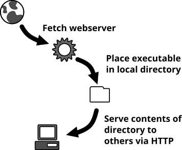

# Local Webserver


## Introduction

This repository provides local webservers which serve the local directory in
which they were stored.



If the server is stored at `/home/user/tmp/mydir/lw` it will serve
all files in `/home/user/tmp/mydir/` - please see the ["Usage"](#usage)-section
for a more complete example.

After starting the server it opens a new site in your web browser. You can also
choose an network interface the server should listen on.

To open the browser with the url, `open` is used on Mac OS X, `start` under
Windows and `xdg-open` on Linux/Other operating systems.

You may want to use `lw` to ...

* share data on demand from your local machine without the hassle of filesystem
  permissions or setting up a network share
* serve a built presentation &ndash; e.g. [`reveal.js`](https://github.com/hakimel/reveal.js)
* load data from your local machine onto some network device

What makes `local-server` so nice and sweet?
* It's just one single executable
* It has just a few options and does not use a configuration file
* It can be compiled for multiple platforms - e.g. Mac OS X, Windows and Linux
* It chooses a random port on startup, so there's no conflict with other
  instances of `local_server` &ndash; can be overridden
* You can choose which interface the server should listen on.

## Usage

The server will ask you what interface it should use on startup. If you do
nothing and wait 7s or press ENTER 127.0.0.1 will be chosen.

* Start server with random port (1023 < port < 65535) and `localhost` as interface (mind the `*` ) and be verbose:

  ~~~
  ./lw
  # => Available Interfaces
  # => [ 1]               enp0s25: 151.217.104.62
  # => [ 2]               enp0s25: 2001:67c:20a1:1104:7cab:7900:6e5:49bd
  # => [ 3]*                   lo: 127.0.0.1
  # => [ 4]                    lo: ::1
  # => [ 5]              vboxnet0: 192.168.99.1
  # => Enter Number [1-5] (Timeout: 7s, Default: 3, Press Enter for Default):
  ~~~

* Start server with port and interface defined

  ~~~
  ./lw --port 1234 --interface 127.0.0.2
  # => 
  # => Server listens on 127.0.0.2:1234
  # => 
  # => Requests:
  # => 
  ~~~

* Serve a different directory

  ~~~
  ./lw --directory /usr/share/doc
  # or
  ./lw --directory ~/
  # => 
  # => Available Interfaces
  # => [ 1]               enp0s25: 151.217.104.62
  # => [ 2]               enp0s25: 2001:67c:20a1:1104:7cab:7900:6e5:49bd
  # => [ 3]*                   lo: 127.0.0.1
  # => [ 4]                    lo: ::1
  # => [ 5]              vboxnet0: 192.168.99.1
  # => Enter Number [1-5] (Timeout: 7s, Default: 3, Press Enter for Default):
  # => 
  # => Server listens on 127.0.0.1:17150
  # => 
  # => Requests:
  ~~~

* Do not output anything, but request which interface should be used

  ~~~
  ./lw --silent --port 1234 --interface 127.0.0.1
  # => 
  # => Available Interfaces
  # => [ 1]               enp0s25: 151.217.104.62
  # => [ 2]               enp0s25: 2001:67c:20a1:1104:7cab:7900:6e5:49bd
  # => [ 3]*                   lo: 127.0.0.1
  # => [ 4]                    lo: ::1
  # => [ 5]              vboxnet0: 192.168.99.1
  # => Enter Number [1-5] (Timeout: 7s, Default: 3, Press Enter for Default):
  ~~~


* Do not output anything, but request which interface should be used

  ~~~
  ./lw --silent --port 1234 --interface 127.0.0.1
  ~~~

## Pre-Compiled Binaries

There are pre-compiled binaries available. Just head over to the [releases
page](https://github.com/feduxorg/local-webserver/releases)

## Development

This project was built with Google `Go`. See [this
page](https://golang.org/doc/) for some documentation about developing software
with "Go". If you're interested to cross-compile this application: I wrote an
[blog article](https://www.fedux.org/articles/2017/07/29/bootstrapping-go.html)
about how a setup an environment for that.

### Requirements

* [`Go`](http://golang.org) needs to be installed
* `make` needs to be installed.
* [`Bourne (compatible) shell`](http://en.wikipedia.org/wiki/Bourne_shell)
  needs to be installed.

### Setup environment

This will install all required `Go`-modules. It will also check if all required
other software packages are installed.

```bash
bin/setup
```

### Build application

Run this script and have a look for the build binaries in dist. Set the `GOOS`
and `GOARCH` to the required values - defaults `GOOS=linux` and `GOARCH=amd64`.

```bash
./bin/build
```

### Build docker image

```bash
./bin/docker/build
```

## License

Please see the [LICENSE.md](LICENSE.md).
